# Voice Agent Tequity Framework 🎤🤖

A comprehensive modular voice agent framework that combines **LLM (Large Language Models)**, **STT (Speech-to-Text)**, and **TTS (Text-to-Speech)** pipelines for intelligent voice interactions.

[](https://voice-agent-framework-tequit-docs.onrender.com)
[](https://github.com/kishanravi887321/voice_agent_framework)
[](https://pypi.org/project/voice-agent-tequity/)

## 🌟 Overview

The Voice Agent Tequity Framework is designed to create intelligent voice assistants that can:
- Listen to user speech in real-time
- Convert speech to text using advanced STT services
- Process queries using multiple LLM providers
- Respond with natural-sounding voice using TTS
- Store and retrieve knowledge from vector databases
## 📚 Framework Documentation

[**https://voice-agent-framework-tequit-docs.onrender.com**](https://voice-agent-framework-tequit-docs.onrender.com)


Visit our comprehensive documentation for:
- **Detailed API Reference** - Complete class and method documentation
- **Advanced Examples** - Real-world implementation guides
- **Best Practices** - Performance optimization tips
- **Troubleshooting** - Common issues and solutions
- **Contributing Guide** - How to contribute to the framework

## 🛠️ Installation & Setup
```bash
pip install voice-agent-tequity
```
## 🏗️ Framework Architecture

```mermaid
graph TB
    %% User Interaction Layer
    User[👤 User] -->|Speech| Mic[🎤 Microphone]
    Speaker[🔊 Speaker] -->|Voice Response| User
    
    %% Audio Processing Layer
    Mic -->|Audio Stream| STT[🎙️ Speech-to-Text AssemblyAI WebSocket]
    STT -->|Transcribed Text| Router{🔀 Router}
    
    %% Processing Decision
    Router -->|Vector Mode| VectorAgent[📚 TrainVoiceAgent]
    Router -->|Direct Mode| LLMAgent[🧠 VoiceAgent]
    
    %% Vector Database Flow
    VectorAgent -->|Query| VectorDB[(🗄️ Pinecone Vector Database)]
    VectorDB -->|Relevant Chunks| VectorAgent
    VectorAgent -->|Context + Query| LLM_V[🤖 LLM Provider]
    
    %% Direct LLM Flow
    LLMAgent -->|Direct Query| LLM_D[🤖 LLM Provider]
    
    %% LLM Providers
    LLM_V & LLM_D --> Gemini[🔮 Google Gemini]
    LLM_V & LLM_D --> OpenAI[🏢 OpenAI GPT]
    LLM_V & LLM_D --> Claude[🎭 Anthropic Claude]
    LLM_V & LLM_D --> Ollama[💻 Ollama Local]
    LLM_V & LLM_D --> Custom[⚙️ Custom LLM]
    
    %% Response Processing
    Gemini & OpenAI & Claude & Ollama & Custom -->|Generated Response| TTS[🗣️ Text-to-Speech ElevenLabs]
    TTS -->|Audio Output| Speaker
    
    %% Data Training Flow
    DataFolder[📁 Data Folder txt files] -->|Training Data| Embedder[🔢 Sentence Transformer Embeddings]
    Embedder -->|Vector Embeddings| VectorDB
    
    %% Configuration
    EnvFile[📄 .env File API Keys] -.->|Configuration| STT
    EnvFile -.->|Configuration| LLM_V
    EnvFile -.->|Configuration| LLM_D
    EnvFile -.->|Configuration| TTS
    EnvFile -.->|Configuration| VectorDB

    %% Styling with dark text
    classDef userLayer fill:#e1f5fe,stroke:#01579b,stroke-width:2px,color:#000
    classDef audioLayer fill:#f3e5f5,stroke:#4a148c,stroke-width:2px,color:#000
    classDef processLayer fill:#e8f5e8,stroke:#1b5e20,stroke-width:2px,color:#000
    classDef llmLayer fill:#fff3e0,stroke:#e65100,stroke-width:2px,color:#000
    classDef dataLayer fill:#fce4ec,stroke:#880e4f,stroke-width:2px,color:#000
    classDef configLayer fill:#f1f8e9,stroke:#33691e,stroke-width:2px,color:#000
    
    class User,Speaker,Mic userLayer
    class STT,TTS audioLayer
    class Router,VectorAgent,LLMAgent processLayer
    class Gemini,OpenAI,Claude,Ollama,Custom,LLM_V,LLM_D llmLayer
    class VectorDB,DataFolder,Embedder dataLayer
    class EnvFile configLayer
```



```
voice_agent_framework/
├── voice_agent/               # Core framework modules
│   ├── __init__.py           # Package initialization
│   ├── voice_agent.py        # 🎯 MAIN ENTRY POINT - Core VoiceAgent & TrainVoiceAgent classes
│   ├── voice_agent2.py       # Extended voice agent with real-time STT integration
│   ├── llm/                  # LLM providers integration
│   │   ├── base.py           # Abstract base class for LLMs
│   │   ├── gemini_llm.py     # Google Gemini integration
│   │   ├── openai_llm.py     # OpenAI GPT integration
│   │   ├── claude_llm.py     # Anthropic Claude integration
│   │   ├── ollama_llm.py     # Local Ollama integration
│   │   └── custom_llm.py     # Custom LLM wrapper
│   ├── stt/                  # Speech-to-Text modules
│   │   ├── base.py           # STT base implementations
│   │   └── speech_to_text.py # Real-time STT with AssemblyAI
│   ├── tts/                  # Text-to-Speech modules
│   │   └── evenlabs_tts.py   # ElevenLabs TTS integration
│   ├── gather/               # Vector database operations
│   │   ├── base.py           # Base vector handler
│   │   └── vector_read.py    # Pinecone vector operations
│   └── utils/                # Utility modules
├── data_folder/              # Training data for vector DB
├── main.py                   # Basic usage examples (note: only for demo)
├── main2.py                  # Real-time voice interaction demo (note: only for demo)
└── requirements.txt          # Dependencies
```

## 🎯 **Main Entry Points**

The framework provides two primary classes in `voice_agent/voice_agent.py`:

### 1. **VoiceAgent** - Basic LLM with TTS
```python
from voice_agent.voice_agent import VoiceAgent

# Simple LLM interaction with automatic speech output
agent = VoiceAgent(llm_type="gemini", api_key="your_key")
response = agent.run_llm("Hello, how are you?")
```

### 2. **TrainVoiceAgent** - Vector Database + LLM
```python
from voice_agent.voice_agent import TrainVoiceAgent

# Knowledge-based responses with vector search
trainer = TrainVoiceAgent(train=True, folder_path="./data")
response = trainer.retrieve_data("What is AI?")
```

### 3. **SpeechToText** - Real-time Voice Interaction
```python
from voice_agent.voice_agent2 import SpeechToText

# Complete voice-to-voice interaction
stt = SpeechToText(api_key="your_key", vector_mode=True)
stt.start()  # Start listening and responding
```

## 🚀 Key Features

### 🧠 **Multi-LLM Support**
- **Google Gemini**: Fast and efficient for general queries
- **OpenAI GPT**: Advanced reasoning and conversation
- **Anthropic Claude**: Ethical AI with strong safety measures
- **Ollama**: Local LLM hosting for privacy
- **Custom LLM**: Integration with any API-based LLM

### 🎙️ **Real-time Speech Processing**
- **AssemblyAI Integration**: High-accuracy real-time transcription
- **WebSocket Streaming**: Low-latency audio processing
- **Audio Recording**: Automatic session recording for analysis

### 🔊 **Natural Voice Synthesis**
- **ElevenLabs TTS**: High-quality, natural-sounding voice generation
- **Multiple Voice Options**: Customizable voice personalities
- **Multilingual Support**: Support for various languages

### 📚 **Knowledge Management**
- **Vector Database**: Pinecone integration for semantic search
- **RAG (Retrieval Augmented Generation)**: Context-aware responses
- **Document Processing**: Automatic chunking and embedding
- **Personalized Knowledge**: User-specific knowledge bases

## 🛠️ Installation & Setup

### Prerequisites
- Python 3.8+
- Audio input/output devices
- Internet connection for cloud services

### 1. Clone the Repository
```bash
git clone https://github.com/kishanravi887321/voice_agent_framework.git
cd voice_agent_framework
```


**OR** install from source:
```bash
pip install -r requirements.txt
```

### 3. Environment Configuration
Create a `.env` file in the root directory:

```env
# LLM API Keys (only required for cloud-based LLMs)
GOOGLE_API_KEY=your_gemini_api_key_here
OPENAI_API_KEY=your_openai_api_key_here
ANTHROPIC_API_KEY=your_claude_api_key_here
OPENROUTER_API_KEY=your_openrouter_api_key_here

# TTS Service
ELEVEN_API_KEY=your_elevenlabs_api_key_here

# Vector Database (Pinecone)
PINECONE_API_KEY=your_pinecone_api_key_here
PINECONE_INDEX_NAME=your_index_name_here
PINECONE_START_URL=your_pinecone_url_here
PINE_CONE_ENV=your_pinecone_environment_here

# STT Service (AssemblyAI)
ASSEMBLYAI_API_KEY=your_assemblyai_api_key_here

# Database (Optional)
DB_URL=your_database_url_here

# Note: Ollama (local LLM) doesn't require an API key
# Just install Ollama locally and it will work without configuration
```

## 🎯 How to Use

### Framework Flow Patterns

```mermaid
graph LR
    %% Pattern 1: Basic LLM
    subgraph "Pattern 1: Basic LLM Interaction"
        A1[Text Input] --> B1[VoiceAgent] --> C1[LLM Provider] --> D1[TTS Output]
    end
    
    %% Pattern 2: Voice Conversation
    subgraph "Pattern 2: Real-time Voice Conversation"
        A2[🎤 Speech] --> B2[STT] --> C2[LLM] --> D2[TTS] --> E2[🔊 Audio]
    end
    
    %% Pattern 3: Knowledge Base
    subgraph "Pattern 3: Vector-Enhanced Responses"
        A3[🎤 Speech] --> B3[STT] --> C3{Vector DB} --> D3[LLM + Context] --> E3[TTS] --> F3[🔊 Audio]
        G3[📁 Training Data] --> C3
    end

    %% Styling
    classDef inputNode fill:#e3f2fd
    classDef processNode fill:#f1f8e9
    classDef outputNode fill:#fce4ec
    
    class A1,A2,A3,G3 inputNode
    class B1,B2,B3,C1,C2,C3,D3 processNode
    class D1,D2,E2,E3,F3 outputNode
```



### Basic LLM Interaction
```python
from voice_agent.voice_agent import VoiceAgent
import os

# Initialize with Gemini
agent = VoiceAgent(
    llm_type="gemini", 
    api_key=os.getenv("GOOGLE_API_KEY")
)

# Ask a question (speaks the response automatically)
response = agent.run_llm("What is artificial intelligence?")
print(response)
```

### Real-time Voice Conversation
```python
from voice_agent.voice_agent2 import SpeechToText
import os

# Initialize real-time voice agent
stt = SpeechToText(
    api_key=os.getenv("ASSEMBLYAI_API_KEY"), 
    llm_type="gemini", 
    vector_mode=False
)

# Start listening (Ctrl+C to stop)
stt.start()
```

### Knowledge Base Training
```python
from voice_agent.voice_agent import TrainVoiceAgent

# Train with documents from data_folder
trainer = TrainVoiceAgent(
    train=True, 
    folder_path="./data_folder", 
    email="user@example.com"
)

# Query the knowledge base
chunks = trainer.retrieve_data("What are healthcare chatbots?")
```

### Vector-Enhanced Voice Agent
```python
from voice_agent.voice_agent2 import SpeechToText

# Enable vector database mode for context-aware responses
stt = SpeechToText(
    api_key=os.getenv("ASSEMBLYAI_API_KEY"), 
    vector_mode=True
)

stt.start()  # Now uses knowledge base for answers
```

## 🔧 Configuration Options

### LLM Provider Configuration
```python
# OpenAI Configuration
agent = VoiceAgent(
    llm_type="openai", 
    api_key="your_key",
    model_name="gpt-4"
)

# Local Ollama Configuration
agent = VoiceAgent(
    llm_type="ollama", 
    model_name="llama3"
)

# Claude Configuration
agent = VoiceAgent(
    llm_type="claude", 
    api_key="your_key",
    model_name="claude-3"
)
```

### Voice & Audio Settings
```python
stt = SpeechToText(
    api_key="your_key",
    sample_rate=16000,          # Audio sample rate
    channels=1,                 # Mono audio
    input_device_index=None     # Auto-detect microphone
)
```

### Vector Database Settings
```python
trainer = TrainVoiceAgent(
    folder_path="./custom_data", 
    email="namespace@example.com"  # Unique namespace
)
```

## 🌐 API Integration Guide

### Supported LLM Providers

| Provider | API Key Required | Local Hosting | Cost | Configuration |
|----------|------------------|---------------|------|---------------|
| Google Gemini | ✅ | ❌ | Free tier available | `GOOGLE_API_KEY` |
| OpenAI GPT | ✅ | ❌ | Pay-per-use | `OPENAI_API_KEY` |
| Anthropic Claude | ✅ | ❌ | Pay-per-use | `ANTHROPIC_API_KEY` |
| OpenRouter | ✅ | ❌ | Pay-per-use | `OPENROUTER_API_KEY` |
| Ollama | ❌ | ✅ | Free (local) | No API key needed |
| Custom API | ✅ | Configurable | Varies | Custom API key |

### Getting API Keys

1. **Google Gemini**: [Google AI Studio](https://makersuite.google.com/app/apikey)
2. **OpenAI**: [OpenAI Platform](https://platform.openai.com/api-keys)
3. **Anthropic Claude**: [Anthropic Console](https://console.anthropic.com/)
4. **OpenRouter**: [OpenRouter Platform](https://openrouter.ai/keys)
5. **ElevenLabs**: [ElevenLabs Platform](https://elevenlabs.io/)
6. **AssemblyAI**: [AssemblyAI Dashboard](https://www.assemblyai.com/)
7. **Pinecone**: [Pinecone Console](https://www.pinecone.io/)
8. **Ollama**: [Download Ollama](https://ollama.ai/) - No API key required, runs locally

## 📊 Usage Examples

### Example 1: Healthcare Assistant
```python
# Train with healthcare data
trainer = TrainVoiceAgent(
    train=True,
    folder_path="./healthcare_data",
    email="healthcare@clinic.com"
)

# Voice-enabled healthcare queries
stt = SpeechToText(
    api_key=os.getenv("ASSEMBLYAI_API_KEY"),
    vector_mode=True
)
stt.start()
```

### Example 2: Personal Assistant
```python
# General purpose assistant
agent = VoiceAgent(llm_type="openai")
response = agent.run_llm("Schedule a meeting for tomorrow")
```

### Example 3: Educational Tutor
```python
# Load educational content
trainer = TrainVoiceAgent(
    folder_path="./educational_content",
    email="student@university.edu"
)

# Interactive learning session
stt = SpeechToText(vector_mode=True)
stt.start()
```

## 🤝 How to Connect & Contribute

### For Developers
1. **Fork the repository** on GitHub
2. **Clone your fork** locally
3. **Create a feature branch**: `git checkout -b feature/amazing-feature`
4. **Make your changes** and test thoroughly
5. **Commit your changes**: `git commit -m 'Add amazing feature'`
6. **Push to the branch**: `git push origin feature/amazing-feature`
7. **Open a Pull Request**

### For Users
- 🐛 **Report Bugs**: Open an issue with detailed description
- 💡 **Feature Requests**: Suggest new features via GitHub issues
- 📖 **Documentation**: Help improve documentation
- 🎤 **Testing**: Test with different use cases and provide feedback

### Community & Support
- **📚 Documentation**: [Complete Framework Documentation](https://voice-agent-framework-tequit-docs.onrender.com)
- **GitHub Issues**: [Report bugs or request features](https://github.com/kishanravi887321/voice_agent_framework/issues)
- **Discussions**: Join GitHub Discussions for questions
- **Email**: Contact [kishanravi887321@gmail.com](mailto:kishanravi887321@gmail.com)

### Business Integration
For enterprise integration or custom development:
- **Consultation**: Available for custom implementations
- **Training**: Workshops and training sessions
- **Support**: Priority technical support packages

## 🔒 Security & Privacy

- **API Keys**: Never commit API keys to version control
- **Local Processing**: Option to use local LLMs (Ollama)
- **Data Isolation**: Vector databases support user namespacing
- **Audio Privacy**: Audio files are saved locally only

## 📈 Performance Optimization

### Tips for Better Performance
1. **Use appropriate LLM**: Choose based on speed vs. quality needs
2. **Optimize chunk size**: Adjust vector database chunk size for your data
3. **Local LLMs**: Use Ollama for privacy and reduced latency
4. **Batch processing**: Process multiple queries together when possible

## 🔄 Updates & Roadmap

### Current Version: 0.1.0
- ✅ Multi-LLM support
- ✅ Real-time voice processing
- ✅ Vector database integration
- ✅ Modular architecture

### Upcoming Features
- 🔮 Multi-language support
- 🔮 Conversation memory
- 🔮 Voice cloning capabilities
- 🔮 Mobile app integration
- 🔮 Docker containerization

## 📝 License

This project is licensed under the MIT License - see the [LICENSE](LICENSE) file for details.

## 🙏 Acknowledgments

- **ElevenLabs** for high-quality TTS
- **AssemblyAI** for real-time STT
- **Pinecone** for vector database services
- **Google, OpenAI, Anthropic** for LLM APIs
- **Ollama** for local LLM hosting

---

**Made with ❤️ by [Ravi Kishan](https://github.com/kishanravi887321)**

*Transform your applications with intelligent voice interactions!*
